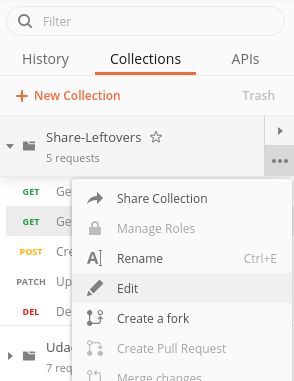
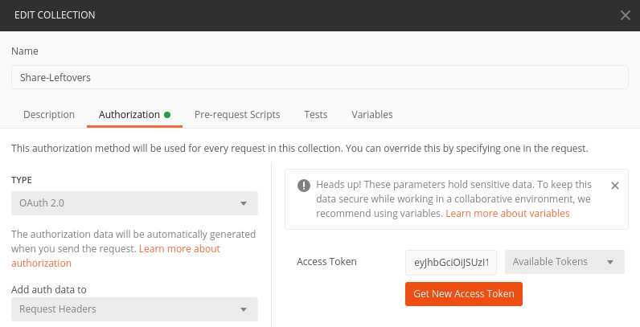
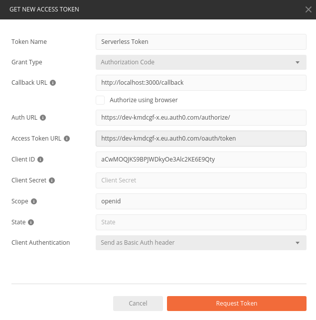
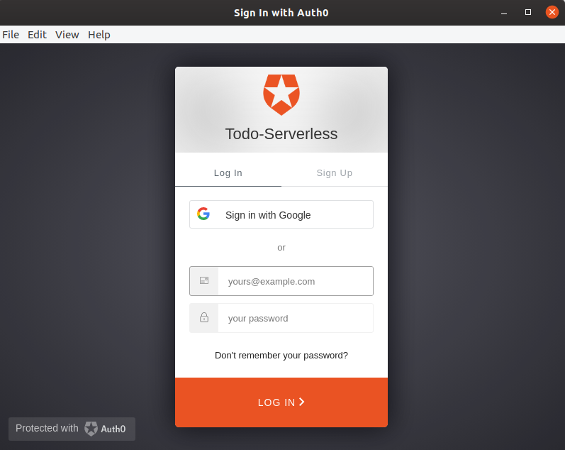
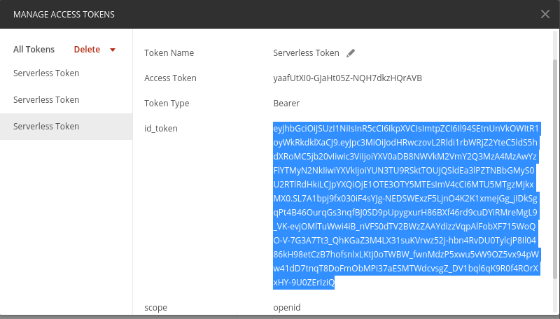
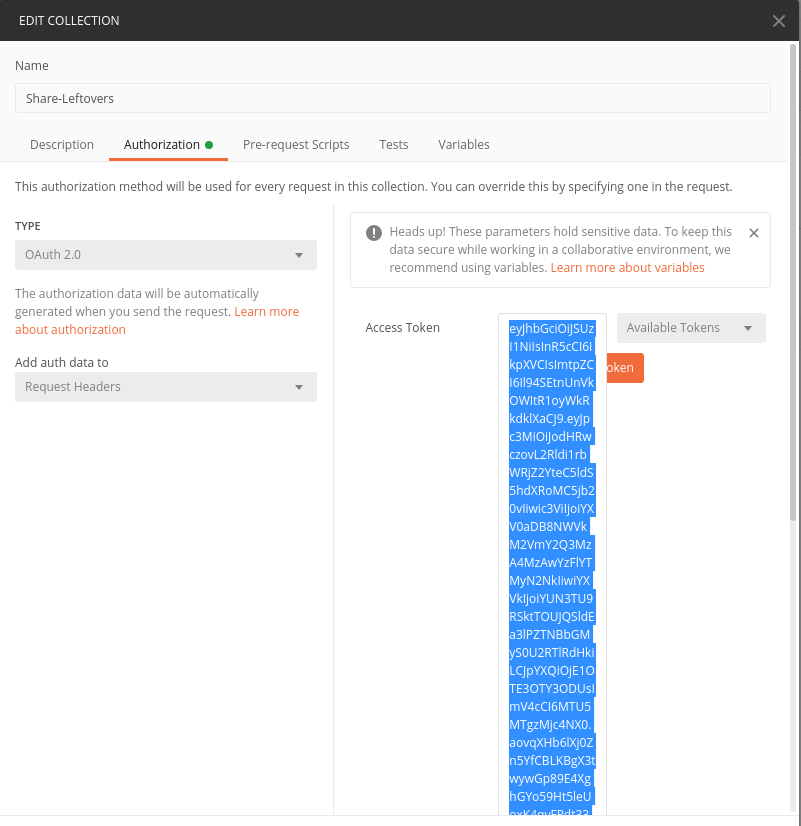

# Share Leftovers App

## Overview

This app lets users share images of their leftover food. Other people can contact them and fetch the leftovers.
Users are able to login, get, update and delete their items. And can also upload images.

Endpoints:
- GET - https://b9rsz7l5g9.execute-api.eu-central-1.amazonaws.com/dev/useritems
- POST - https://b9rsz7l5g9.execute-api.eu-central-1.amazonaws.com/dev/feed
- PATCH - https://b9rsz7l5g9.execute-api.eu-central-1.amazonaws.com/dev/feed/{itemId}
- DELETE - https://b9rsz7l5g9.execute-api.eu-central-1.amazonaws.com/dev/feed/{itemId}
- POST - https://b9rsz7l5g9.execute-api.eu-central-1.amazonaws.com/dev/feed/{itemId}/attachment

This project demonstrates the usage of:
- serverless framework
- serverless offline 
- AWS lambda architecture
- API Gateway REST-API and validations
- Authentication and authorization with Auth0
- DynamoDB integration
- S3 signedUrl Upload
- AWS X-Ray
- Ports and Adapter Architecture (separation of business and data layer)

## Instructions with Postman

1. Authenticate postman
2. Use Postman requests

### How to authenticate in Postman

1. Go to the `Authorization` tab in the Postman collection. All requests will inherit this authorization method

2. Select Type `OAuth2.0` and `Request Headers`

3. Select `Get New Access Token`
4. Enter the following information and click `Get New Access Token`
    - `Grant Type`: `Authorization Code`
    - `Callback Url`: http://localhost:3000/callback
    - Uncheck `Authorize using browser`
    - `Auth URL`: https://dev-kmdcgf-x.eu.auth0.com/authorize/
    - `Access Token Url`: https://dev-kmdcgf-x.eu.auth0.com/oauth/token
    - `Client ID`: aCwMOQJKS9BPJWDkyOe3Alc2KE6E9Qty
    - Leave `Client Secret` empty
    - `Scope`: openid
    - Leave `State` empty
    - For `Client Authentication` select `Send as Basic Auth header`

5. You should be greeted with a login/registration page. Please register and login. Note: Clear cookies in Postman if there are cookies from previous sessions (https://stackoverflow.com/questions/28305273/how-to-delete-session-cookie-in-postman)

7. **DO NOT CLICK `Use Token`**, it does not work. Instead, copy the `id_token` into the Access Token field.


8. Now you should be able to do all requests.

### How to use Postman collection

Example workflow:
1. Create two items
2. Get user items
3. Update one item by giving a itemId (get this from previous request 2.)
4. Get user items
5. Delete one item by giving a itemId
6. Get user items
7. Get upload url by giving a itemId
8. Upload image, by copying returned Url into the `Upload file` PUT request with a binary body, where you select a local file to upload


## Deployment
To deploy an application run the following commands:

```
cd backend
npm install
sls deploy -v
```

## Run local version
```
cd backend
npm install
sls dynamodb install
sls offline start
```